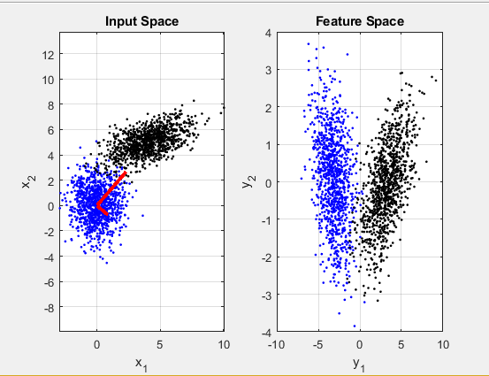
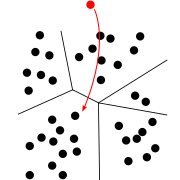
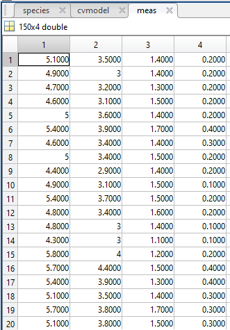

# DecisionTree-PCA-Apriori in Matlab
 In this repository i am going to implement Decision Tree, Principle Component Analysis, Apriori in Matlab with an example.

## 1. PCA – Hauptkomponentenanalyse: 

Die Hauptkomponentenanalyse (englisch Principal Component Analysis, kurz PCA) ist ein Verfahren der multivariaten Statistik. 
Man versucht die Attribute zu ersetzen durch eine Menge von Linearkombinationen dieser, wodurch die Anzahl reduziert wird.

<figure class="image">
  
</figure>

  Daten von einem 3 dimensiomnalen Vektorraum in einen 2 dimensionalen Vektorraum

Die Daten werden dabei durch eine Hauptachsentransformation in einen Vektorraum mit einer neuen Basis überführt und dadurch wird die Korrelation der Attribute minimiert.

Das ganze lässt sich gut anschaulich erklären, wenn man die Daten als Wolke oder Ellipse in einem n-dimensionalem Raum auffasst. Dabei wird der Ursprung des Koordinatensystems in den Schwerpunk der Wolke gelegt. Nun werden nach und nach die Achsen so ausgerichtet, dass den Richtungen mit der größten Varianz bzw. der größten Ausdehnung folgen. Dabei entspricht die erste Achse der größten Ausdehnung und die zweite Achse der zweitgrößten Ausdehnung

#### 1.1 [Implementierung des Algorithmus](https://github.com/A2Amir/DecisionTree-PCA-Apriori-in-Matlab/tree/master/PCA):

Um PCA Algorithmus zu implementieren habe ich zuerst ein kleines Dataset( in ein 2-dimensionalen Raum mit 1000 Punkten als Daten) in MATLAB erzeugt und für PCA angewendet.

Nachdem ich PCA Algortithmus auf mein Dataset ausgeübt habe, habe ich es gesehen, dass der Umfang der Daten in Dataset von 2 dimensionalem Raum(x1,x2) zu 1 dimensionalem Raum (y1 sogar ohne y2) ersetzen kann. Genauer gesagt,Daten werden von einem 2 dimensiomnalen Vektorraum (X1,X2)  in einen 1 dimensionalen Vektorraum (y1) überführt.

 
  
 

## 2. Klassifikation und Decision Tree:

Eine Klassifikation,ist eine planmäßige Sammlung von abstrakten Klassen, die zur Abgrenzung und Ordnung verwendet werden
Bei der Klassifikation geht es ähnlich der Clusteranalyse darum, Objekte Gruppen (hier als Klassen bezeichnet) zuzuordnen. Im Gegensatz zur Clusteranalyse sind hier aber in der Regel die Klassen vordefiniert (Beispielsweise Blumentypen: Iris setosa, Iris virginica, ) und es werden Verfahren aus dem maschinellen Lernen eingesetzt um bisher nicht zugeordnete Objekte diesen Klassen zuzuordnen.
 
  
 

**Decision Tree**
Diese Methode, die als Entscheidungsbaum-Lernen bezeichnet wird, ist eine Klassifikationsmethode und berücksichtigt unterschiedliche Aspekte eines Elements, um dessen Wert einzuschätzen.
Um eine Klassifikation eines einzelnen Datenobjektes abzulesen, geht man vom Wurzelknoten entlang des Baumes abwärts. Bei jedem Knoten wird ein Attribut abgefragt und eine Entscheidung über die Auswahl des folgenden Knoten getroffen. Diese Prozedur wird so lange fortgesetzt, bis man ein Blatt erreicht. Das Blatt entspricht der Klassifikation. Ein Baum enthält grundsätzlich Regeln zur Beantwortung von nur genau einer Fragestellung.

 
  
 

