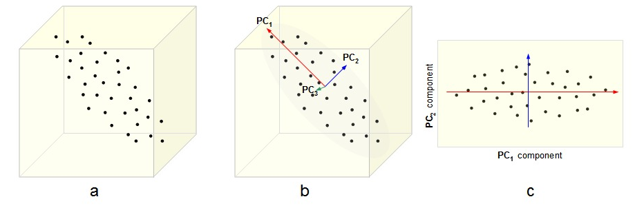

# DecisionTree-PCA-Apriori in Matlab
 In this repository i am going to implement Decision Tree, Principle Component Analysis, Apriori in Matlab with an example.

PCA – Hauptkomponentenanalyse: 
Die Hauptkomponentenanalyse (englisch Principal Component Analysis, kurz PCA) ist ein Verfahren der multivariaten Statistik. 
Man versucht die Attribute zu ersetzen durch eine Menge von Linearkombinationen dieser, wodurch die Anzahl reduziert wird.

<figure class="image">
  
  <figcaption>{{ Daten von einem 3 dimensiomnalen Vektorraum in einen 2 dimensionalen Vektorraum}}</figcaption>
</figure>
